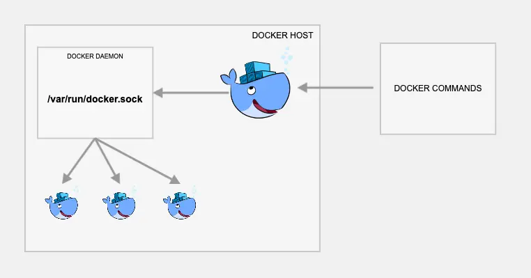

# readme

### develop

```bash
# at project root
$ docker compose up -d

# get into docker
$ docker compose exec -it express bash

# inside docker
$ npm i -D

# create image
$ node ./create_image.js

# start using npm
$ npm run start or npx nodemon dev

# start using shell script
$ npx nodemon --exec "sh ./test.sh"
```



- image credit https://devopscube.com/run-docker-in-docker/
